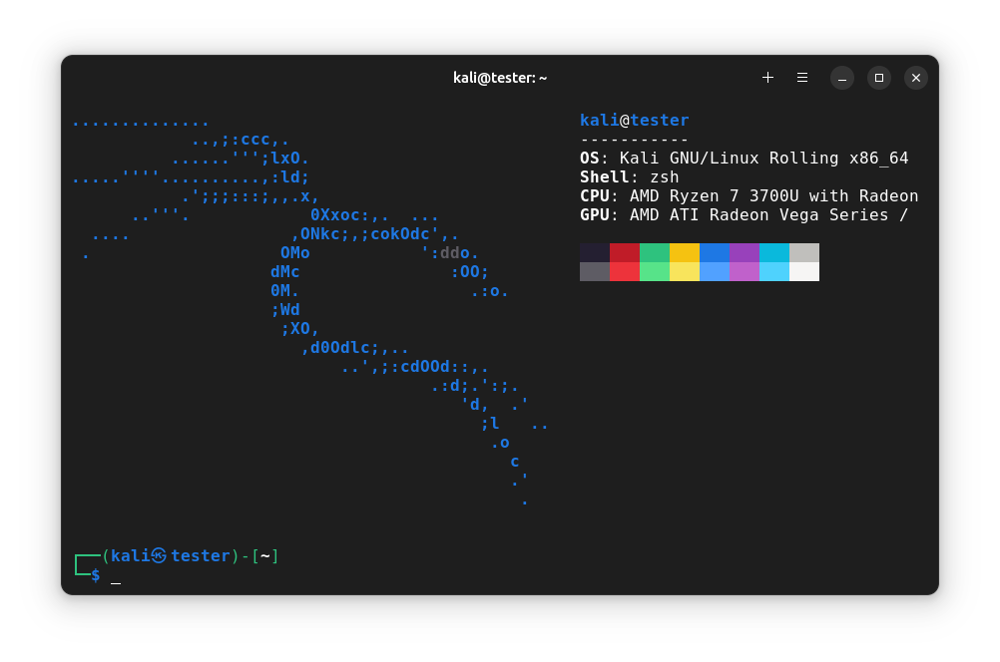

<div align="center">

# Linux Containers (Dockerfiles)
### A repository of Dockerfiles to be built into container environments.
[](https://docker.com)
[](https://kali.org/)
[](https://ubuntu.com/desktop)
[](https://fedoraproject.org/)
[](https://www.opensuse.org/)
#

[](#introduction) <sup> **•** </sup>
[](#how-to-run-it) <sup> **•** </sup>
[](#how-to-use-it) <sup> **•** </sup>
[](#script-breakdown)

</div>

### Introduction
This is a personal repository of Dockerfiles, made to quickly configure container environments, which are meant to be used interactively. It also demonstrates how to create & use Dockerfiles and the main docker commands, which are used in the shell script at the root directory.

Some Dockerfile configurations are altered locally before building the image, depending on what is necessary.

### How to Run it
Simply give execution permissions & run the shell script located at the root directory with the desired distros as argument.

The script will pull the latest official image of the given distros and build the environment automatically. It will also create a local shell script as a command to easily run the container. Instructions:

```sh
cd linux-containers

chmod +x $(pwd)/build-container.sh
$(pwd)/build-container.sh ubuntu

run-ubuntu
```

### How to Use it
The containers are to be used interactively, as a... _contained_ <sub>(heh)</sub> environment for development, as a pocket distro.

When entering a container, a local user with elevation privileges will be available. For privileged actions, it will be necessary to set a password after first accessing the environment. The root account is completely locked away and inaccessible.

After setting the password, use normally as one would with any distro.

<div align="center">
  <div>
    
    
  </div>
  
  <div>
    
    
  </div>
</div>

#
###### Script breakdown:
```sh
Available builds: kali ubuntu
Build container cmd ex.: ./build-container.sh ubuntu
Run container cmd ex.: run-ubuntu
____________________________________________________

## Make sure we have a clean slate, removes previously used containers  / images
docker container stop Ubuntu && docker container remove Ubuntu && docker image remove ubuntu-build
____________________________________________________

# Always pull latest base image
docker pull ubuntu &&\

## Build image from Dockerfile
docker build --force-rm --tag ubuntu-build "$(pwd)/ubuntu-dockerfile/" &&\

## Create a container from built image
docker create --name Ubuntu --interactive --tty --hostname coder --user ubuntu --volume "$HOME/.docker/Ubuntu:/home/shared" ubuntu-build &&\

## We can make either an alias or shell script to start the created container:
# echo 'alias run-ubuntu="docker start Ubuntu && docker attach Ubuntu"' >> "$HOME/.profile"
echo -e '#!/bin/sh\n'"docker start Ubuntu && docker attach Ubuntu" > "$HOME/.local/bin/run-ubuntu" && chmod +x "$HOME/.local/bin/run-ubuntu"
```
#

<div align="center">

[](#linux-containers-dockerfiles)

</div>
